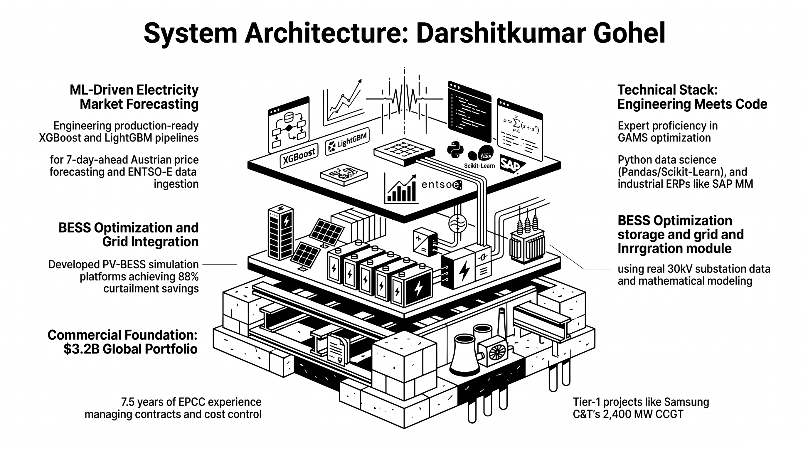
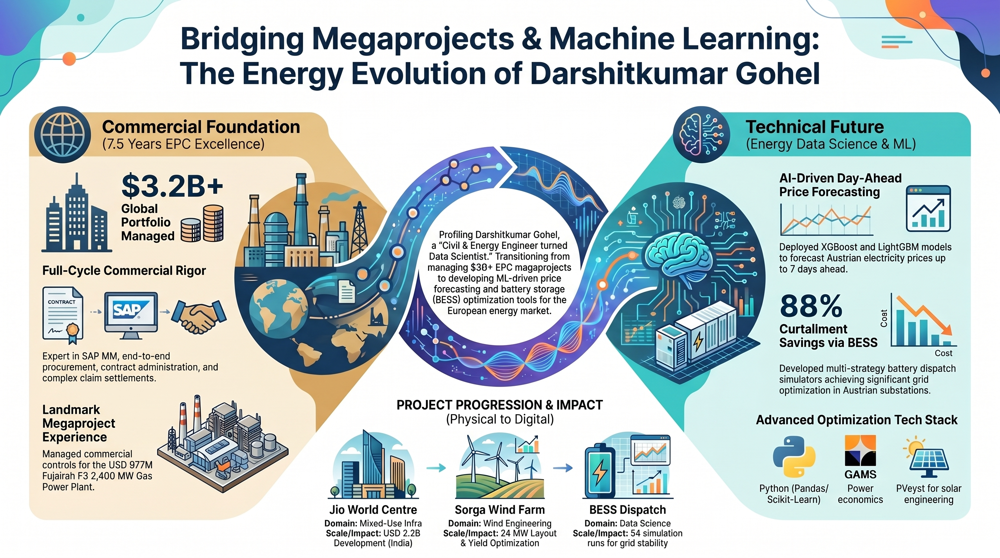

<!-- ============================================================
     HEADER
     ============================================================ -->

<h1 align="center">Darshitkumar Gohel</h1>

<em>Energy Data Scientist &nbsp;·&nbsp; BESS &amp; Electricity Markets &nbsp;·&nbsp; ML Forecasting</em>

 

---

<!-- ============================================================
     GITHUB PROFILE SUMMARY  (NEW)
     ============================================================ -->

&nbsp;&nbsp;

---

<!-- ============================================================
     ABOUT
     ============================================================ -->
## 🧑‍💻 About

| Energy Systems & ML Architecture Stack | 
|:---:|
|  | 
| *Three-tiered architectural overview bridging physical EPC infrastructure, substation BESS integration, and algorithmic price forecasting* |

Civil & energy engineer turned energy-data scientist - bridging **7.5 years of EPC megaproject delivery** (USD 3B+ portfolios across India, UAE, and Austria) with a focused pivot into **battery storage analytics, ML price forecasting, and European electricity market modelling**.

I understand energy infrastructure not just as data - but as physical systems with real commercial stakes.

| Career Trajectory - Megaprojects to Machine Learning | 
|:---:|
|  | 
| *The energy evolution: Bridging $3.2B+ global EPC management with AI Day-Ahead forecasting and 88% BESS curtailment savings* |

| | |
|---|---|
| 🎓 **Education** | MSc Sustainable Energy Systems - FH Upper Austria, Wels *(thesis: PV-BESS simulation & grid optimisation)* |
| 🏢 **Industry** | Samsung C&T · Tata Consulting Engineers · Gleeds Consulting · Enery GmbH (Vienna) |
| ⚡ **Domain Focus** | BESS profitability · day-ahead price forecasting · PV curtailment reduction |
| 🌍 **Markets** | AT · DE · PL · SE · SK electricity market data pipelines (ENTSO-E, Open-Meteo) |
| 📍 **Location** | Wels, Austria - open to NL · IE · UK · EU remote |

---

<!-- ============================================================
     PROJECTS
     ============================================================ -->
## 🚀 Projects

### ⚡ [ML Day-Ahead XGBoost Energy Price Forecaster - Austria](https://github.com/AIMLDS7/ML_Dayahead_XGBoost_energy_price_forecaster_Austria)

Forecasts Austrian day-ahead electricity prices (€/MWh) up to **7 days ahead** using iterative lag-feedback XGBoost trained on 2020–2025 EPEX auction data. Features dual interactive Plotly charts, configurable date-range UI, and one-click CSV export.

> **Outcomes:** 1/3/7-day horizon switching · daily low/high summary table · production-ready notebook · AT market focus

---

### 🔀 [PyPSA-AT Analytics](https://github.com/AIMLDS7/pypsa-at_analytics)

Provenance-first analytics toolkit for PyPSA-AT power system simulations. Every solved network run is fingerprinted and checkpointed into a manifest, then appended into a durable Parquet store - so overwriting `results/*.nc` on the next solve never means losing the ability to compare scenarios. An 8-tab Streamlit workbench ties it together with automated config-diffing and KPI deltas.

> **Outcomes:** run provenance & config diffing · append-only Parquet analytics store · 8-tab Streamlit dashboard · zero `.nc` duplication

---

### 🌦️ [Weather Station Data Pipeline & Interactive Analytics Dashboard](https://github.com/AIMLDS7/Weather-Station-Data-Pipeline-Interactive-Analytics-Dashboard)

End-to-end ingestion, correction, and visualization pipeline for a multi-station meteorological monitoring network - from secure SFTP acquisition through timestamp correction to an interactive, weekly-chunked sensor dashboard. Cross-validates ground-based solar irradiance against clear-sky reference models for PV performance QA.

> **Outcomes:** multi-station SFTP ingestion · automated data-availability audit · clear-sky irradiance benchmarking (pvlib) · A3 print-grade PNG/PDF/HTML export

---

### ⚡ [PV-Battery Curtailment Analysis Tool](https://github.com/AIMLDS7/PV-Battery-Curtailment-Analysis-Tool)

Techno-economic curtailment study for a grid-constrained 10.16 MW Austrian PV site paired with a 4.3 MWh BESS. Seven physically-correct dispatch strategies are benchmarked across two full calendar years of 15-minute data, with automated capacity-sizing sweeps to hit any curtailment-reduction target.

> **Outcomes:** 922 MWh/year recovered (best strategy) · 7 dispatch strategies ranked · strict battery-causality model · interactive dashboards + DOCX/Excel reporting

---

### 🛰️ [NASA POWER Hourly Climate Data Downloader - Global](https://github.com/AIMLDS7/NASA_POWER_Hourly_Climate_Data_Downloader_Global)

Interactive Jupyter pipeline wrapping the NASA POWER REST API - replacing the manual data-access-viewer portal with a reproducible, scriptable workflow. Cleans `-999` flags, parses UTC timestamps, and structures hourly climate data (2001–present) across 25+ preset locations into ML-ready CSV/Excel output that feeds directly into the day-ahead price forecaster's weather features.

> **Outcomes:** 25+ location presets, no API key required · automatic `-999`→`NaN` cleaning · deterministic reproducible file naming · direct feed into the XGBoost price forecaster

---

### ☀️ [Solar & Wind Climate Analysis - Berlin & Honolulu](https://github.com/AIMLDS7/Data-Analysis-for-Solar-and-WInd)

Multi-decade meteorological analysis using NASA POWER data. ARIMA/SARIMA time-series forecasting of solar irradiance, wind speed, and temperature with **95% confidence intervals** across two geographically distinct locations.

> **Outcomes:** Z-score outlier removal · correlation heatmaps · seasonal decomposition · SARIMA with CI

---

### ⚙️ [Energy Systems Optimization & Data Engineering](https://github.com/AIMLDS7/Energy-Systems-Optimization)

A production-grade mathematical modeling package utilizing Mixed-Integer Quadratic Constrained Programming (MIQCP) and Non-Linear Programming (NLP). Implements a 24-hour Unit Commitment schedule and 5-bus DC Optimal Power Flow (DC-OPF) models. Includes a Python data visualization layer for grid congestion analysis.

> **Outcomes:** 24hr MIQCP solver · N-1 Contingency Analysis · Python Data Extraction Pipeline

---

<!-- ============================================================
     TECH STACK
     ============================================================ -->
## 🛠️ Tech Stack

**Core**

**Data Science & ML**

**Visualisation & Data Sources**

**Tools**

---

<!-- ============================================================
     GITHUB STATS  (NEW - streak + activity graph)
     ============================================================ -->
## 📊 GitHub Stats

 

---

<!-- ============================================================
     CAREER BACKGROUND
     ============================================================ -->
## 🏗️ Career Background

**7.5 years of end-to-end EPC megaproject delivery** across power generation, infrastructure, and renewable energy sectors:

| Company | Role | Scale |
|---|---|---|
| Enery Österreich GmbH | BESS Business Development Support | Vienna, Austria |
| Tata Consulting Engineers Limited (TCE) | Assistant Manager - Cost & Contracts | Mass Housing Project, India |
| Gleeds consulting (india) private limited | Assistant Cost Manager | IHCL, India |
| Samsung C&T Corporation | Cost, Contracts & Procurement | Fujairah F3 CCGT - USD 977M, UAE |
| Samsung C&T Corporation | Cost, Contracts & Procurement | Jio World Centre - USD 2.2B, India |

**Expertise:**

---

<!-- ============================================================
     CONNECT  (NEW - cleaner layout)
     ============================================================ -->
## 🤝 Connect

---

⚡ Energy · Data · Impact  
<em>"The best infrastructure is invisible - it just works."</em>

